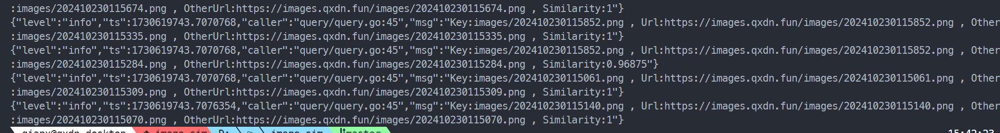

# 图片相似检测

因为我的~~涩图库~~OSS Buck里面存在一些重复或者相似图片，这主要是因为我搜刮群里色图的时候忘记检查是否已经存在了，所以可能重复上传。因此写一个简单的工具来检测图片的相似度，找出可能重复的图片，顺便学学go。

# 使用

```shell
# 建库
go run ./cmd/refresh/refresh.go
# 查询
go run ./cmd/query/query.go
```

# 效果



- similarity: 1
<div style="display: flex">
  <div>
    <h3 style="position: absolute;color: black;">202410230115140.png</h3>
    
  </div>
  <div>
    <h3 style="position: absolute;color: black;">202410230115070.png</h3>
    
  </div>
</div>

- similarity: 0.96875
<div style="display: flex">
  <div>
    <h3 style="position: absolute;color: black;">202410230115852.png</h3>
    
  </div>
  <div>
    <h3 style="position: absolute;color: black;">202410230115284.png</h3>
    
  </div>
</div>


# TODO

- [x] 接入OSS SDK
- [x] 存储hash值到数据库
- [x] 查询重复图片
- [x] 限制线程池数
- [ ] better log